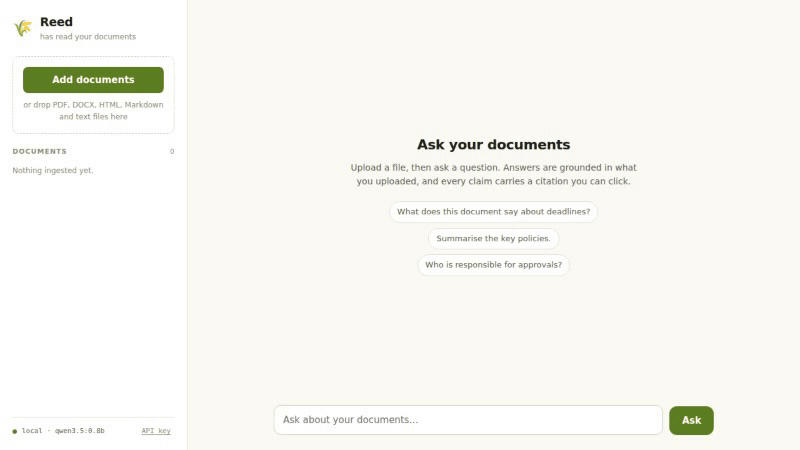
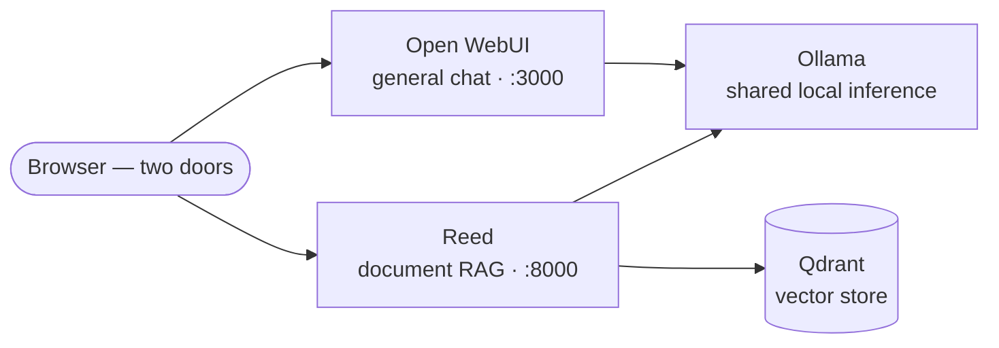

# private-ai-stack

**A production-minded local AI stack — general chat plus document Q&A with
verifiable citations — in one `docker compose up -d`.** Nothing leaves your
machine: no cloud APIs, no telemetry, models run on your own hardware.

[](https://github.com/Ulzuhan/private-ai-stack/actions/workflows/ci.yml)
[](https://github.com/Ulzuhan/private-ai-stack/actions/workflows/security.yml)
[](https://github.com/Ulzuhan/private-ai-stack/releases)
[](LICENSE)



> **Status: v0.1.0.** Everything on `main` works and is verified in CI on a
> clean runner — stack up, smoke tests, backup/restore round-trip, browser
> E2E on both UIs. Benchmarks and the GPU and air-gap profiles are in; the
> release publishes an attested air-gap bundle. Still on the roadmap: the
> production override.

## The problem

Teams under GDPR, data-processing agreements, or sector regulation cannot
paste their documents into a cloud chatbot — and per-token pricing turns
heavy usage into a recurring invoice. The usual alternative is a pile of
tutorials and a weekend of glue work. This repo is the glue work, done once,
with the receipts: a single command brings up local inference, a chat UI, and
a document RAG pipeline whose answers cite the exact passage they rely on.

## Constraints it is built under

- **Consumer hardware** — 8 GB RAM minimum, no GPU required; the default
  model pair (`qwen3.5:4b` + `embeddinggemma`) is sized for laptops.
- **No external dependencies at runtime** — after the first model pull the
  stack needs no internet; an air-gapped packaging mode is on the roadmap.
- **Operable without MLOps** — one compose file, healthchecks, backup and
  restore as scripts, configuration through a documented `.env`.
- **Verifiable claims** — everything the README promises is exercised in CI
  on every change, on a clean runner. "Works on my machine" is not a claim
  this repo makes; "works on a machine you can watch" is.

## Architecture



| Service | Pinned image | Role |
|---|---|---|
| [Ollama](https://ollama.com) | `ollama/ollama:0.32.5` | Local inference, shared by the whole stack |
| model-init (one-shot) | `ollama/ollama:0.32.5` | Pulls the models on first `up` — keeps the quickstart a single command |
| [Qdrant](https://qdrant.tech) | `qdrant/qdrant:v1.19.0` | Vector store behind the RAG service, never exposed to the host |
| [Open WebUI](https://github.com/open-webui/open-webui) | `ghcr.io/open-webui/open-webui:v0.11.0` | General chat UI over the shared models |
| [Reed](https://github.com/Ulzuhan/reed) | `ghcr.io/ulzuhan/reed:0.5.1` | Document RAG with citations, hybrid retrieval and its own UI |

Every image is pinned by tag **and digest**. Containers run hardened
(`read_only`, `cap_drop: ALL`, `no-new-privileges` where the service allows
it), telemetry is off by default everywhere, and all ports bind to
`127.0.0.1` only. The full reasoning — alternatives considered, state and
consistency model — lives in [docs/architecture.md](docs/architecture.md).

**Two doors, one rule:** Open WebUI is for general chat, Reed is for your
documents. File upload inside Open WebUI is disabled on purpose so documents
always go through the RAG pipeline — retrieval you can inspect, citations you
can click, refusals when the documents don't answer. The browser E2E keeps
this boundary as a permanent regression check.

### Design decisions and trade-offs

| Decision | Alternative discarded | Why |
|---|---|---|
| Two UIs with one job each | One UI doing chat + RAG | Uploading a document into a general chat UI bypasses the pipeline that makes answers verifiable |
| One shared generation model | A model per service | Two loaded models don't fit consumer RAM |
| No observability stack in v0.1 | Langfuse from day one | Its services would triple the container count to show an empty dashboard — nothing emits traces yet. Lands in v0.2 together with instrumentation |
| Env-var-only Open WebUI config | Its admin panel | `ENABLE_PERSISTENT_CONFIG=false` keeps the compose file the single source of truth |
| Containers for everything, except… | — | …on macOS, where the fast path is a native Ollama on the host (BYO override) — Docker has no Metal passthrough |

### Why not Harbor / local-ai-packaged?

Those are fine generalist launchers for dozens of services. This stack
resolves **one use case end to end** — chat plus document Q&A with verifiable
citations — and spends the difference on rigor: a RAG service with calibrated
hybrid retrieval, versioned documents and a published golden-set evaluation;
zero telemetry by default; hardening and a threat model in writing; and a
browser E2E over both UIs on every PR instead of a smoke test.

## Quickstart

```bash
docker compose up -d
```

That single command is the whole setup: a one-shot `model-init` service pulls
the models (~4 GB) on first start. Follow it with
`docker compose logs -f model-init`. (`./scripts/preflight.sh` checks RAM,
disk and Docker beforehand if you want the early warning.)

Then open:

- **Chat** — Open WebUI at <http://127.0.0.1:3000>. The first visit creates
  the admin account, locally.
- **Your documents** — Reed at <http://127.0.0.1:8000>. Upload a PDF,
  Markdown, DOCX or text file and ask; answers stream with clickable
  citations.

### On a Mac? Bring your own Ollama

Docker on macOS has no Metal passthrough, so the containerized Ollama runs
CPU-only. The fast path is a [native Ollama](https://ollama.com/download)
on the host:

```bash
ollama pull qwen3.5:4b && ollama pull embeddinggemma
docker compose -f docker-compose.yml -f docker-compose.byo.yml up -d
```

## Requirements

- Docker with Compose v2.30+
- 8 GB RAM minimum (16 GB comfortable) for the default `qwen3.5:4b` +
  `embeddinggemma` pair
- ~15–20 GB free disk for images and models

## Configuration

Everything is tunable through environment variables — see
[`.env.example`](.env.example) for the documented set. The stack runs with no
`.env` file at all.

## Deployment profiles

- **cpu** (default, what you just ran) — consumer hardware, shared 4B model.
- **BYO Ollama** (`docker-compose.byo.yml`) — native inference on the host;
  the fast path on Apple Silicon.
- **gpu** (`docker-compose.gpu.yml`) — NVIDIA acceleration and the larger
  `qwen3.5:9b`, on Linux/Windows with the Container Toolkit. Validated
  syntactically in CI; its benchmark cells await community hardware
  ([issue #8](https://github.com/Ulzuhan/private-ai-stack/issues/8)).
- **air-gap** (`scripts/package-offline.sh` + `docker-compose.airgap.yml`) —
  bundle the stack on a connected machine, install it on an isolated one
  with container egress cut. The full loop — package, wipe, install, smoke
  with NAT disabled — runs in CI on every change, and every release
  publishes an attested bundle built with the full default models:
  [docs/air-gap.md](docs/air-gap.md).
- **production (TLS + auth)** — on the post-v0.1.0 roadmap; it lands with
  its own CI validation before it is documented as supported.

## Results

What is verified **on every change**, on a clean GitHub runner:

- the full stack comes up from scratch and every service reports healthy;
- the LLM answers, Reed ingests a document and returns a **cited** answer,
  both UIs serve;
- a backup is taken, every volume is wiped, the restore brings the document
  back and it still answers with citations;
- a browser drives both UIs end to end (admin signup and chat, document
  upload → question → citation, and the no-upload-door rule for non-admin
  users).

RAG quality is measured where measurement makes sense: Reed's published
evaluation against its golden set of 41 questions, with the same model pair
and retrieval configuration this stack ships — see
[Reed](https://github.com/Ulzuhan/reed).

Performance, measured and published with the platform declared per number
in [docs/benchmarking.md](docs/benchmarking.md):

- **36.3 tokens/s** generation with `qwen3.5:4b` on an Apple M5 (native
  Ollama, BYO mode), 1.9 s cold / 0.2 s warm to first token;
- **19 s** from `compose up` to a usable system in CI with models cached,
  95 s including the cold model pull;
- **~2.9 GiB RAM** for the whole stack after the smoke test.

The CI numbers come from the `benchmarks.yml` workflow — any fork can
re-run them on its own runner and compare receipts.

## Operations

Backup is a consistent **pair** — Reed's own archive plus a Qdrant snapshot,
labeled together — and restore is a tested path, not a hope: the round-trip
runs in CI on every PR.

```bash
./scripts/backup.sh                 # timestamped, rotated (keep 5)
./scripts/restore.sh backups/<label>
```

Upgrades, model changes, the Open WebUI PersistentConfig gotcha, the admin
file-upload caveat and how to expose the stack beyond localhost:
[docs/operations.md](docs/operations.md).

## Security

Zero telemetry by default in every component; images pinned by digest and
scanned with Trivy on every PR and weekly against newly published CVEs;
secrets scanning over the full git history; loopback-only ports; container
hardening per service. The threat model, the per-component telemetry list and
what the stack deliberately does **not** do:
[docs/hardening.md](docs/hardening.md).

## Roadmap

- **v0.1.0** ✅ — the stack above, with a release pipeline that publishes an
  attested air-gap bundle ([changelog](CHANGELOG.md)).
- **v0.2** — production override (Caddy TLS + basic auth), Reed↔Open WebUI
  integration (pipes/functions) and real observability with Langfuse,
  instrumenting Reed upstream.

## License

[Apache-2.0](LICENSE).

---

*Built by José M. Cotarelo — at [Hesperia Labs](https://hesperialabs.com) we
deploy and operate stacks like this on-premises for regulated industries.*

*Documentación en español: [README.es.md](README.es.md).*
