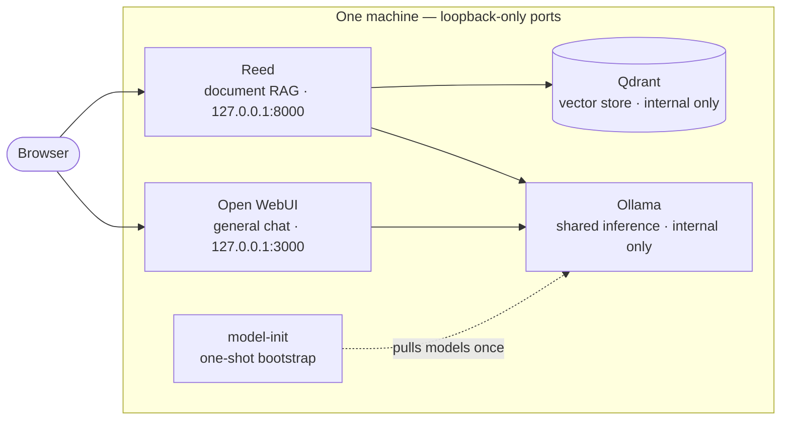

# Architecture

The stack is one compose file with five services and four named volumes.
Everything runs on one machine; after the first model pull, nothing needs
the internet.

## Components

| Service | Pinned image | Why this one |
|---|---|---|
| Ollama | `ollama/ollama:0.32.5` | The de-facto local inference server; one instance shared by chat and RAG because two loaded models don't fit consumer RAM |
| model-init | (reuses the Ollama image) | One-shot service that pulls the models on first `up` — without it "one command to run everything" would be a false promise |
| Qdrant | `qdrant/qdrant:v1.18.3` | Vector store behind Reed; internal only, never published to the host |
| Open WebUI | `ghcr.io/open-webui/open-webui:v0.11.0` | The most complete local chat UI; configured exclusively through env vars |
| Reed | `ghcr.io/ulzuhan/reed:0.4.1` | Document RAG built for verifiability: calibrated hybrid retrieval, clickable citations, versioned documents, refusals when the evidence isn't there |

Every image is pinned by tag **and digest**; Dependabot keeps the pins fresh
and the security workflow scans exactly the pinned set, so a bump can never
sneak past the scanner.

## Two doors, one rule

Open WebUI is the **chat** door; Reed is the **documents** door. Open WebUI's
own file upload (the entry to its built-in RAG) is disabled via
`USER_PERMISSIONS_CHAT_FILE_UPLOAD=false`, because a document uploaded there
would bypass the pipeline that makes answers verifiable. The browser E2E
keeps this boundary under permanent regression: it asserts that a role-`user`
account sees the upload entry disabled, with the tooltip explaining why.

Known caveat, verified against the Open WebUI v0.11.0 sources and by the E2E:
the permission governs role `user`; Open WebUI hardcodes an allow for
`admin`. In a single-user quickstart that one user is the admin, so the
upload entry stays enabled for them. The operational guidance ("documents go
to Reed") and the regression test on the role-user boundary are the stack's
answer — see [operations.md](operations.md#file-uploads-and-the-admin-caveat).

## State and the consistency pair

Four named volumes: Ollama models, Qdrant storage, Reed data (SQLite
registry + stored originals + embedding cache) and Open WebUI's database.
**Reed's registry and Qdrant's chunks are two halves of the same state** —
that is why `backup.sh` produces a labeled pair and why restore brings both
halves back together. Reed versions its index fingerprint and can rebuild
the vectors from the stored originals (`reed index reindex`), which is the
robust fallback when the Qdrant half of a backup is missing or suspect.
Details in [operations.md](operations.md#backup-and-restore).

## Decisions worth writing down (ADR-lite)

- **Env-var-only Open WebUI configuration.** Open WebUI persists most env
  vars into its database on first boot and silently ignores them afterwards.
  `ENABLE_PERSISTENT_CONFIG=false` keeps the compose file the single source
  of truth. If you already booted without it, see
  [operations.md](operations.md#open-webui-persistentconfig-gotcha).
- **`REED_PROFILE=local` is load-bearing.** Without it Reed starts in its
  OpenAI profile and the stack silently stops being local.
- **Bare env entries are deliberate.** `REED_MIN_EVIDENCE_SCORE`,
  `REED_EMBED_QUERY_PREFIX` and `REED_EMBED_DOC_PREFIX` are passed through
  unset so Reed's calibrated, model-aware presets apply; setting them (even
  empty) is an explicit override.
- **No observability stack in v0.1.** Langfuse self-hosted needs Postgres +
  ClickHouse + Redis + MinIO; nothing in the stack emits traces yet, so the
  override would triple the container count to show an empty dashboard. It
  lands in v0.2 together with the instrumentation that feeds it.
- **Containers by default, native Ollama on macOS.** Docker has no Metal
  passthrough; on Apple Silicon the containerized Ollama is CPU-only and
  several times slower than a native one. `docker-compose.byo.yml` points
  the stack at `host.docker.internal:11434`. On Linux/Windows with an NVIDIA
  GPU, `docker-compose.gpu.yml` reserves the device for the containerized
  Ollama and defaults to the larger `qwen3.5:9b`.
- **One generation model, configurable.** `GENERATION_MODEL` (default
  `qwen3.5:4b`, fallback `qwen3:4b`) feeds both doors; `EMBEDDING_MODEL`
  (default `embeddinggemma`) feeds Reed. CI runs the same wiring with the
  tiny `qwen3.5:0.8b` — it proves the circuit, never answer quality.

## Where things live

| Path | Contents |
|---|---|
| `docker-compose.yml` | The whole stack, cpu profile |
| `docker-compose.byo.yml` | Override: use a native Ollama on the host |
| `docker-compose.gpu.yml` | Override: NVIDIA reservation + `qwen3.5:9b` default |
| `docker-compose.airgap.yml` | Override: no NAT off the bridge, no pulls, model-init verifies |
| `docker-compose.ci.yml` | Override: CI resource limits and the tiny model |
| `config/models.yaml` | Model catalog per profile + licenses; meta-tested against the compose files |
| `.env.example` | Every tunable, documented; a meta-test keeps it in lockstep with the compose files |
| `scripts/` | `preflight.sh`, `smoke-test.sh`, `backup.sh`, `restore.sh`, `package-offline.sh`, `benchmark-local.py`, `qdrant-snapshot.py` |
| `tests/meta/` | Machine-checked invariants (env parity, workflow/ruleset parity, docs drift) |
| `tests/e2e/` | Playwright journeys over both UIs; videos are published as CI artifacts |
| `assets/demo.gif` | Recorded from the E2E run on `main` |
